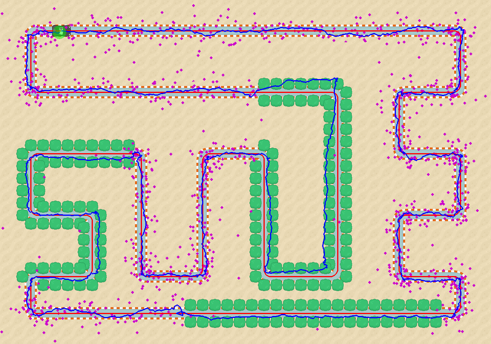

# Visualizing a Kalman Filter with KalmanCar

## Overview
I created a simulation that uses a Kalman filter to track the position of a car driving around a race track.  I wrote the code in Python 3.7 and created the animation using PyGame and public domain art assets (see Acknowlegements section).  A **requirements.txt** file is included.  The Python files of interest are:

 - **KalmanFilter** is a general-purpose implementation of a Kalman filter.
 - **RaceTrack** contains three classes that create the race track, move the car, and draw the Kalman filter estimates and estimate uncertainty.
 - **KalmanCar** contains the main program loop that instantiates the KalmanFilter and RaceTrack classes and runs the animation.
 
The following sections give some brief background on the Kalman filter itself, as well as discuss how I implemented the filter and how tuning the simulation parameters impacts performance.

## Kalman Filter Overview
The discrete Kalman filter is composed of five equations split into two groups: the time update or "prediction" equations and the measurement update or "correction" equations.
$$
\text{\underline{Time update equations (predict):}} \\[0.3em]
\begin{aligned} 
\bold{\hat{x}_k^-} &= \bold{A \hat{x}_{k-1} + B u_{k-1}} \hspace{2em}&(1) \\
\bold{P_k^-} &=\bold{ A P_{k-1} A^T + Q} \hspace{2em}&(2) 
\end{aligned} \\[-1.5em]
$$
$$
\text{\underline{Measurement update equations (correct):}} \\[0.3em]
\begin{aligned} 
\bold{K_k} &= \bold{P_k^- H^T (H P_k^- H^T + R)^{-1}} \hspace{2em}&(3) \\
\bold{\hat{x}_k} &= \bold{\hat{x}_k^- + K_k (z_k - H \hat{x}_k^-)} \hspace{2em}&(4) \\
\bold{P_k} &= \bold{(I - K_k H) P_k^-} \hspace{2em}&(5)
\end{aligned}
$$
The notation shown here is from professors Greg Welch and Gary Bishop's [An Introduction to the Kalman Filter](https://www.cs.unc.edu/~welch/media/pdf/kalman_intro.pdf).  The Kalman filter seeks to estimate the state of a process at time step $k$, which is represented mathematically as the vector $\bold{x_k}$.  The hat on $\bold{\hat{x}_k}$ in equation $(4)$ means that it is an estimate of the true process state $\bold{x_k}$, which is not known.  In addition to the estimate itself, the Kalman filter also provides a measure of its estimate uncertainty via $\bold{P_k}$, the estimate error covariance matrix $(5)$.

The operation of the Kalman filter is split into two parts.  First, the time update or "prediction" equations that provide *a priori* estimates of the state and estimate uncertainty.  The minus superscript seen in $\bold{\hat{x}_k^-}$ and $\bold{P_k^-}$ on the left side of equations $(1)$ and $(2)$ mean that they are *a priori* estimates at step $k$ based on knowledge of the process at the prior step $k-1$.  

After a measurement is made, the second part of the filter operation is the computation of the measurement update or "correction" equations.  The Kalman gain $\bold{K_k}$ is calculated in $(3)$ and used to compute $\bold{\hat{x}_k}$ and $\bold{P_k}$ (no minus superscript) which are the *a posteriori* state estimate and estimate uncertainty at step $k$ after taking measurement $\bold{z_k}$.  This process takes place recursively as shown in the flowchart below:

The Kalman gain $\bold{K_k}$ minimizes the *a posteriori* error covariance $\bold{P_k}$.  It does this by weighting how much it "trusts" the measurement(s) $\bold{z_k}$ made at each time step.  If the measurement error covariance $\bold{R}$ approaches zero, the filter "trusts" the measurements more than it does its internal process model (predictions).  In this case, the estimated state is almost wholly based on the measurements.  If instead $\bold{R}$ increases significantly or $\bold{P_k^-}$ approaches zero, the filter trusts the measurements less and its internal process model more.  In this case, the measurement is ignored and the *a priori* prediction $\bold{\hat{x}_k^-}$ becomes the *a posteriori* state estimate $\bold{\hat{x}_k}$. 

The standard Kalman filter makes the following assumptions:

 1. The process and measurement errors are zero-mean and normally distributed (Gaussian distribution).
 2. The process and measurement errors are independent of each other.
 3. The measurement errors are mutually independent.
 4. The process being estimated is a linear dynamical system that can be modeled with a [state-space representation](https://en.wikipedia.org/wiki/State-space_representation).     

Other variations of the Kalman filter such as the Extended or Unscented Kalman filter may be more appropriate if these assumptions are violated.
### Time Update (Predict)
The time update prediction portion of the Kalman filter encompasses equations $(1)$ and $(2)$.  The notation of the left-hand side of both equations $(1)$ and $(2)$ have the minus superscript, which indicates that they are *a priori* estimates.  These estimates occur before the results of the next measurement are known.  Equation $(1)$ predicts the current state of the process using a state-space model.
#### KalmanCar State-Space Model
The `KalmanCar` simulation attempts to estimate the position of the car along the race track.  The states to be estimated by the filter are the car's x-coordinate, y-coordinate, velocity in the x-direction, and velocity in the y-direction.  The car presumably has a driver who manipulates the controls of the vehicle by stepping on the accelerator or the brake pedal and by turning the steering wheel.  However, for this simulation the car is assumed to be a black box where the control inputs are not known to us.  Because of this the control-input model matrix $\bold{B}$ and control variable vector $\bold{u_{k-1}}$ are zero, and equation $(1)$ simplifies to:
$$
\bold{\hat{x}_k^- = A \hat{x}_{k-1}}
$$
$\bold{A}$ is the state transition matrix which transforms the previous state estimate into the current state estimate via a linear process model.  The `KalmanCar` process model is simple: the new x-position estimate is simply the previous x-position estimate plus the previous x-velocity estimate.  The new x-velocity estimate is simply the previous x-velocity estimate.  And the same is true for the y-position and y-velocity.  Note that this means we are assuming zero acceleration of the car such that the velocity is constant.  In fact, this is an erroneous assumption as the car decelerates coming into bends in the track and then accelerates to top speed once back on a straight-away.  However, this model is close enough to get good results as will be shown in a following section.  Equation $(1)$ is now expressed as:
$$
\underbrace{\begin{bmatrix}
\hat{x}_k^- \\
\hat{y}_k^- \\
\hat{\dot{x}}_k^- \\
\hat{\dot{y}}_k^-
\end{bmatrix}}_{\large \bold{\hat{x}_k^-}} =
\underbrace{\begin{bmatrix} 
1 & 0 & 1 & 0 \\
0 & 1 & 0 & 1 \\
0 & 0 & 1 & 0 \\
0 & 0 & 0 & 1 
\end{bmatrix}}_{\large \bold{A}} 
\underbrace{\begin{bmatrix}
\hat{x}_{k-1} \\
\hat{y}_{k-1} \\
\hat{\dot{x}}_{k-1} \\
\hat{\dot{y}}_{k-1} \\
\end{bmatrix}}_{\large \bold{\hat{x}_{k-1}}} 
$$
Where $\hat{x}_k^-$ and $\hat{y}_k^-$ are the *a priori* estimates of the `KalmanCar`'s x and y position at time step $k$, and $\hat{\dot{x}}_k^-$ and $\hat{\dot{y}}_k^-$ are the *a priori* estimates of the `KalmanCar`'s x and y velocity at time step $k$.  Notice that the x-position estimate scalar is written as $\hat x_k^-$, while the state estimate vector is represented by $\bold{\hat x_k^-}$ in bold.  It's unfortunate that the state estimate vector uses $x$ for its notation.  This is potentially confusing, but all vectors and matrices are displayed in bold to distinguish them from scalars.  Multiplying these matrices results in four equations:
$$
\begin{aligned} 
\hat{x}_k^- &= \hat{x}_{k-1} + \hat{\dot{x}}_{k-1} \\
\hat{y}_k^- &= \hat{y}_{k-1} + \hat{\dot{y}}_{k-1} \\
\hat{\dot{x}}_k^- &= \hat{\dot{x}}_{k-1} \\
\hat{\dot{y}}_k^- &= \hat{\dot{y}}_{k-1}
\end{aligned}
$$
These four equations represent the state transition process of the `KalmanCar`'s position and  velocity exactly as described in writing above.  For the Kalman filter's first iteration an initial guess is supplied for $\bold{\hat{x}_{k-1}}$, after which the state estimate is recursively calculated as illustrated by the flow chart.  Note that $\bold{\hat{x}_k^{-}}$ has $n=4$ states and is thus an $(n \times 1)$ vector.  $\bold{A}$ is then an ($n \times n)$ matrix.  $\bold{P_k^-}$ and $\bold{Q}$ are also both $(n \times n)$ covariance matrices.  

#### Estimate Uncertainty and Process Noise
The estimate uncertainty $\bold{P_{k-1}}$ is provided as an initial guess for the first iteration of the filter, but from that point forward its value is calculated every iteration per equations $(2)$ and $(5)$.  Initializing $\bold{P_{k-1}}$ with small values indicates that the initial state estimate guesses for $\bold{\hat{x}_{k-1}}$ are believed to be very accurate.  The opposite is true if $\bold{P_{k-1}}$  is initialized with large values.  These values can be varied to see how quickly the filter converges under different inital conditions.  By default $\bold{P_{k-1}}$  is set to zero in the simulation, as the `KalmanCar` begins at the finish line and so its initial position and velocity are known with a high degree of certainty.

The process noise covariance matrix $\bold{Q}$ can be time-varying, but for the `KalmanCar` simulation it is time invariant and so does not have a $k$ subscript.  The process noise covariance describes how accurate we believe the state transition model is at predicting the `KalmanCar`'s state.  As discussed previously, we know that the state model incorrectly assumes constant velocity and so the process noise must be greater than zero.  Its optimal value can be "tuned" through a process of trial and error.

$\bold{Q}$ must be symmetric but not necessarily diagonal, as the process noise sources may be correlated.  The [Wikipedia article](https://en.wikipedia.org/wiki/Kalman_filter#Example_application,_technical) on the Kalman filter has an example of a truck that moves at a constant velocity but is randomly buffeted by winds that cause the truck to accelerate.  These random forces are assumed to be zero mean and normally distributed, and are included in the state-space equation as an unknown input (acceleration) $a_k$ applied with a matrix $\bold{G}$:
$$
\bold{\hat{x}_k^- = A\hat{x}_{k-1}^- + G}a_k
$$
And $\bold{Q}$ is calculated as:
$$
\bold{Q = G G^T} \sigma_a^2
$$
Where $\sigma_a$ is the standard deviation of the acceleration.  A similar model could be applied to the `KalmanCar` simulation.  The Kalman car decelerates coming into bends and accelerates coming out of bends such that the average acceleration might indeed be close to zero.  The acceleration of the Kalman car is a constant value specified when initializing the `Car()` class, and so it is not normally distributed.  However, I thought it would be an interesting exercise to compare this method of defining $\bold{Q}$ to simply defining it as a diagonal matrix.  If we split $\bold{G}$ and $a_k$ into x and y components we have:
$$
\bold{\hat{x}_k^- = A\hat{x}_{k-1}^- + G_x}a_k^x + \bold{G_y}a_k^y
$$
where:
$$
\begin{aligned}
\bold{G_x} &= 
\begin{bmatrix}
\frac{1}{2} \Delta t^2 \\
0 \\
\Delta t\\
0
\end{bmatrix}\\
\bold{G_y} &= 
\begin{bmatrix} 
0 \\
\frac{1}{2} \Delta t^2 \\
0 \\
\Delta t
\end{bmatrix} \\
\end{aligned}
$$
Then:
$$
\bold{Q = G_x G_x^T} \sigma_a^2 + \bold{G_y G_y^T} \sigma_a^2
$$where $\sigma_a$ is the standard deviation of the zero-mean acceleration and is assumed to be the same in both the x and y directions.  We let $\Delta t = 1$ as there is always a time step of one time unit between updates in the `KalmanCar` simulation.  $\bold{Q}$ is then evaluated as:
$$
\bold{Q} = 
\begin{bmatrix}
\frac{1}{4} \sigma_a^2 & 0 & \frac{1}{2} \sigma_a^2 & 0 \\
0 & \frac{1}{4} \sigma_a^2 & 0 & \frac{1}{2} \sigma_a^2 \\
\frac{1}{2} \sigma_a^2 & 0 & \sigma_a^2 & 0 \\
0 & \frac{1}{2} \sigma_a^2 & 0 & \sigma_a^2
\end{bmatrix}
$$ 
Note that $\bold{Q}$ is symmetric as required for a covariance matrix.  After experimentation, it's not clear that this formulation of $\bold{Q}$ outperforms a diagonal matrix with separate variances for position and velocity.  Both options are included in the `KalmanCar` code.

### Measurement Update (Correct)
The measurement update occurs after the measurement(s) take place, and encompasses equations $(3)$, $(4)$, and $(5)$.  The minus superscript is dropped from $\bold{\hat{x}_k}$ and $\bold{P_k}$, indicating that these are *a posteriori* estimates.  First, the Kalman gain is calculated.

#### Kalman Gain
As mentioned previously, the Kalman gain equation $(3)$ weights how much the Kalman filter trusts the measurement relative to the prediction generated by the internal process model.  If we assume that the observation model matrix $\bold{H} = 1$, then equations $(3)$ through $(5)$ can be written as:
$$
\begin{aligned} 
\bold{K_k} &= \bold{\frac{P_k^-}{P_k^- +R}} \hspace{2em}&(3b) \\
\bold{\hat{x}_k} &= \bold{\hat{x}_k^- + K_k (z_k - \hat{x}_k^-)} \hspace{2em}&(4b) \\
\bold{P_k} &= \bold{(I - K_k) P_k^-} \hspace{2em}&(5b) \\
\end{aligned}
$$
Where $\bold{P_k^-}$ is the *a priori* estimate uncertainty covariance matrix and $\bold{R}$ is the measurement noise covariance matrix.  It's clear that if  the measurement uncertainty $\bold{R \rarr 0}$, then $\bold{K_k \rarr 1}$ and $\bold{\hat{x}_k \rarr z_k}$.  This means the state estimate ignores the process model and completely trusts the measurement $\bold{z_k}$.  Conversely, if $\bold{P_k^- \rarr 0}$ then $\bold{K_k \rarr 0}$ and $\bold{\hat{x}_k \rarr \hat{x}_k^-}$.  The measurement is completely ignored and the *a priori* estimate becomes the Kalman filter's *a posteriori* estimate.

In equation $(3)$ $\bold{R}$ is written without the $k$ subscript, which means that it is time invariant.  This does not have to be the case, and in the `KalmanCar` simulation the measurement certainty does vary over time and should properly be written as $\bold{R_k}$.  
#### Measurements
In the previous section the observation model matrix $\bold{H}$ was assumed to be $1$ for clarity, but in practice $\bold{H}$ is an $(m \times n)$ matrix that relates the measurements to the system states.  In the ``KalmanCar`` simulation there are $m = 4$ measurements that directly measure the four system states, and so $\bold{H}$ is a $(4 \times 4)$ identity matrix:
$$
\bold{H} =
\begin{bmatrix}
1 & 0 & 0 & 0 \\
0 & 1 & 0 & 0 \\
0 & 0 & 1 & 0 \\
0 & 0 & 0 & 1
\end{bmatrix}
$$
In general the number of measurements do not need to equal the number of system states, and the measurements do not need to directly measure the state quantities.  In that case, the observation model matrix will perform the mathematical operations required to convert the system states into the same units as the measurements.

The measurements contained in the $(m \times 1)$ measurement vector $\bold{z_k}$ are the same quantities as the system states $\bold{x_k}$, but the origin of the measurements are from two different sources.  The x and y position of the `KalmanCar` are measured by a GPS satellite, and the quality of the measurement depends on whether the satellite has an unobstructed view of the `KalmanCar`.  The x and y velocity of the `KalmanCar` are derived from an inertial navigation system (INS) that measures the speed and rotation of the `KalmanCar`.  The quality of this dead reckoning approach to navigation deteriorates as errors accumulate over time.  The Kalman filter thus acts as a sensor fusion algorithm, combining the measurements of both the GPS satellite and the INS to provide lower measurement uncertainty than either measurement source alone.

The satellite's position measurement errors and the INS's velocity measurement errors have separate standard deviations.  In addition, the `KalmanCar` simulation has a second satellite measurement error standard deviation that is used whenever the satellite's line of sight to the `KalmanCar` is obstructed by trees.  The $(m \times m)$ measurement noise covariance matrix $\bold{R_k}$ then varies with time:
$$
\begin{aligned}
\bold{R_k} = 
\begin{bmatrix}
\sigma_{Satellite}^2 & 0 & 0 & 0 \\
0 & \sigma_{Satellite}^2 & 0 & 0 \\
0 & 0 & \sigma_{INS}^2 & 0 \\
0 & 0 & 0 & \sigma_{INS}^2 \\
\end{bmatrix}
\end{aligned}
$$
Where it is assumed that the x and y measurements share the same standard deviation $\sigma$.  Again, the measurement errors are assumed to be mutually independent and so $\bold{R_k}$ is a diagonal matrix.

#### State Update Equation
Once the measurements have been made and the Kalman gain has been calculated, the state estimate can be updated per equation $(4)$ repeated below for convenience:
$$\bold{\hat{x}_k} = \bold{\hat{x}_k^- + K_k (z_k - H \hat{x}_k^-)} \hspace{2em} (4)$$
The quantity $(\bold{z_k - H\hat{x}_k^-})$ is called the *measurement innovation* or *residual* and is the difference between the predicted measurement $\bold{H\hat{x}_k^-}$ and the actual measurement $\bold{z_k}$.  As discussed previously, the Kalman gain then weights the estimate towards whichever measurement is less uncertain.  

#### Estimate Uncertainty Update Equation
The final Kalman filter equation updates the estimate uncertainty $\bold{P_k}$:
$$\bold{P_k} = \bold{(I - K_k H) P_k^-} \hspace{2em}(5) $$
Where $\bold{I}$ is the $(n \times n)$ identity matrix.  If the measurement uncertainty is very low such that $\bold{R \rarr 0}$, then the Kalman gain $\bold{K_k \rarr H^{-1}}$ and the quantity in parentheses in equation $(4)$ goes to zero.  This means the estimate uncertainty is also zero, which makes sense because it is based entirely on measurements that have no uncertainty (noiseless).  In the other extreme, the Kalman gain goes to zero and $\bold{P_k}$ is simply equal to the *a priori* estimate uncertainty.  In this case the measurement is so uncertain that it is simply ignored entirely, and only the process uncertainty $\bold{Q}$ from equation $(1)$ plays a role in the final estimate uncertainty.  

### Estimate Uncertainty Insight
In equation $(2)$ the *a priori* estimate uncertainty $\bold{P_k^-}$ is multiplied by the state transition matrix $\bold{A}$ and its transpose before the process noise matrix $\bold{Q}$ is added to it.  

Assume that the initial estimate uncertainty is small: 
$$\bold{P_{k-1}} =
\begin{bmatrix}
1 & 0 & 0 & 0 \\
0 & 1 & 0 & 0 \\
0 & 0 & 0.1 & 0 \\
0 & 0 & 0 & 0.1 
\end{bmatrix}
$$
And $\bold{Q}$ is zero and $\bold{R}$ is large such that $\bold{K_k}$ is nearly zero, then as the Kalman filter iterates:
$$
\begin{aligned}
\bold{P_k^-} &= \bold{A P_{k-1} A^T} &= 
\begin{bmatrix}
1.1 & 0 & 0.1 & 0 \\
0 & 1.1 & 0 & 0.1 \\
0.1 & 0 & 0.1 & 0 \\
0 & 0.1 & 0 & 0.1 
\end{bmatrix} \\
\bold{P_{k+1}^-} &= \bold{A P_{k} A^T} &= 
\begin{bmatrix}
1.4 & 0 & 0.2 & 0 \\
0 & 1.4 & 0 & 0.2 \\
0.2 & 0 & 0.1 & 0 \\
0 & 0.2 & 0 & 0.1 
\end{bmatrix} \\
\bold{P_{k+2}^-} &= \bold{A P_{k+1} A^T} &= 
\begin{bmatrix}
1.9 & 0 & 0.3 & 0 \\
0 & 1.9 & 0 & 0.3 \\
0.3 & 0 & 0.1 & 0 \\
0 & 0.3 & 0 & 0.1 
\end{bmatrix} \\
\end{aligned}
$$
It may take a few more iterations to convince yourself of the pattern, but what is happening here is that the position estimate uncertainties are increasing by the sum of their two corresponding covariances plus the variance of the corresponding velocity uncertainty.  So in order to get the value of 1.9 in the x-coordinate position of $\bold{P_{k+2}^-}$, $sum (1.4 + 0.2 + 0.2 + 0.1) = 1.9$.  The velocity uncertainties are not changed by this matrix multiplication, but in general they will increase over time as well because of the addition of $\bold{Q}$ at each time step in equation $(2)$.  The point here is that the position estimate uncertainties increase much more quickly than the velocity estimate uncertainties because the position estimate is a function of both the previous position and previous velocity estimates, while the velocity estimate is only a function of its own previous state.

In the absence of reliable measurements the Kalman filter will rely on its internal process model.  The uncertainty will then grow over time without a measurement to serve as a correction; the correction step is effectively doing nothing.  However, the estimate uncertainties will not increase indefinitely.  There is an upper bound on estimate uncertainty in the form of equation $(5)$.  As the estimate uncertainty grows, $\bold{K_k}$ also grows.  However, in equation $(5)$ the updated estimate uncertainty is the product of $\bold{(I-K_k H)}$, which decreases as $\bold{K_k}$ increases.  The estimate uncertainty will continue to grow until it reaches this point, at which it will plateau.  This will be seen in the dead reckoning example in the next section.  Conversely, if the initial estimate uncertainty $\bold{P_{k-1}}$ is very large compared to the measurement uncertainty $\bold{R}$, equation $(5)$ will reduce the estimate uncertainty until it reaches a minimum.  This is how the Kalman gain $\bold{K_k}$ minimizes the *a posteriori* error covariance $\bold{P_k}$.  Intuitively, we know that the Kalman filter's estimate uncertainty cannot be worse than the uncertainty of the measurements it receives, and if the process model is at all accurate it should be better than the measurements alone.  This will be demonstrated in the sensor fusion section.

## Experimenting with the Simulation Parameters
### State Transition Model Sanity Check
The first sanity check is to run the `KalmanCar` simulation with noiseless velocity measurements.  To do this, I set the GPS satellite measurement error standard deviation to a very high value (1000) and the process noise variance of diagonal matrix $\bold{Q}$ to a very small number ($10^{-5}$).  The velocity measurement standard deviation is set to zero.  The Kalman filter now believes that the process model is almost perfect and that the velocity measurements are noiseless, while the position measurements from the satellite are highly uncertain and should be ignored.  The result is the image below:

Even with a flawed process model that assumes constant velocity, the Kalman filter estimates (blue line) track the `KalmanCar`'s path (red line) almost perfectly.  There is no green estimate uncertainty bubble shown near the `KalmanCar` because the uncertainty of the INS measurements are zero, hence the estimate's uncertainty is also nearly zero (with a small process error $\bold{Q}$).  This validates that our state transition model is a good one.

The plot of the Kalman filter's x and y position estimate uncertainties show that they are linearly increasing over time, but the magnitude of the uncertainty is tiny.  This is because the satellite measurements are being ignored due to their high uncertainty, and so the position estimate error is simply the repeated addition of the process uncertainty $\bold{Q}$ per equation $(2)$.  Because the values of $\bold{Q}$ were set to $10^{-5}$ the estimate uncertainty accumulates very slowly.  The x and y coordinate uncertainties overlay each other  in the plot because their measurement error standard deviation is the same.  The x and y velocity uncertainties are zero as expected for noiseless measurements.

### Navigating by Dead Reckoning
In the real world the `KalmanCar`'s velocity measurements will not be noiseless.  Leaving all other parameters the same, I changed the standard deviation of the velocity measurement error to 2 pixels/update:

The Kalman filter estimates initially match up well with the `KalmanCar`'s path, but eventually the measurement errors accumulate and the Kalman estimates go completely off-course.  Notice also the large size of the green estimate uncertainty bubble.  The bubble started small, but grew progressively larger as the simulation continued and the velocity measurement errors accumulated.  This can be seen explicitly from the plot of $\bold{P_k}$ for the x and y coordinates:

However, this is not a fair evaluation of the dead reckoning performance.  The process noise is still very small relative to the uncertainty of the velocity measurements.  The velocity measurements are then being almost entirely ignored in favor of the *a priori* velocity estimates.  This can be seen in the uncertainty plot above as the velocity uncertainty being nearly zero (relying completely on *a priori* estimates).  I found that tuning the variance of $\bold{Q}$ to 0.1 gave much better results:

There is still a fair amount of drift in the estimates, but they now follow the path of the race track much more closely.

### Navigating by GPS Only
The other extreme would be to rely solely on GPS navigation to estimate the position of the `KalmanCar`.  The position measurement error standard deviation is set to 20 pixels, but the position sigma when obstructed by trees is left at 1000 pixels.  The velocity measurement error standard deviation is also set to 1000 pixels.  $\bold{Q}$ is left at 0.1 for all diagonal entries.  The Kalman filter now has reliable position measurements, but very uncertain velocity measurements.

The Kalman estimate is fairly good at the beginning of the race track.  However, once the `KalmanCar` reaches the first group of trees the trouble begins.  The trees obstruct the GPS satellite's line of sight, and now both the position *and* velocity measurements are highly uncertain.  The position uncertainty of the `KalmanCar` is visually represented by the diameter of the green circle expanding as the `KalmanCar` enters the trees.  Luckily, this first group of trees is along a straight-away and the `KalmanCar` zooms by them fairly quickly.  The next two groups of trees are along bends in the road, and the `KalmanCar` must slow down and spend more time in these areas.  The Kalman estimates in these areas do not follow the shape of the race track at all, and the blue path "snaps back" to the roadway when the `KalmanCar` exits the trees.  The estimate uncertainty in these obstructed areas can be seen in the three sharp peaks in the estimate uncertainty plot:   

### Sensor Fusion and Filter Tuning
The best performance is achieved when using all information available to the Kalman filter.  The measurement standard deviation of the satellite is set to 20, with the standard deviation when obstructed by trees left at 1000.  The velocity measurement standard deviation is set to 2, and the diagonal variances of $\bold{Q}$ are set to 0.1.

The simulation can also be run with the GPS measurements drawn on the screen as magenta crosses.  The crosses closely cluster around the `KalmanCar` as it drives down the track until it enters the trees, at which point the measurements around the `KalmanCar` are very sparse.  However, the green estimate uncertainty circle does not expand nearly as much as it did in the GPS-only case.  The INS helps keep the estimates fairly close to the race track even in the absence of GPS measurements.

This can be seen in the uncertainty plot above.  The three peaks corresponding to the three groups of trees still exist, but the maximum variance of the position uncertainties are now about 1000, while in the GPS-only case the peaks spiked up to around 25,000.  This is a standard deviation of about 32 pixels with the sensor fusion versus 158 pixels in the GPS-only case - a significant improvement!

### Final Thoughts
So far the Kalman filter's assumed measurement variances have been set equal to the true/actual variance of the measurement sources.  In practice, this may not be true.  These assumed measurement variances can be adjusted independently from the true measurement variances in the `KalmanCar` code to see the impact on filter performance.

The process noise covariance $\bold{Q}$ can also be tuned.  I found that a diagonal matrix of value of 0.1 worked fairly well, but the position and velocity variances can be tuned independently.  Using the $\bold{Q}$ matrix calculated as a function of an unknown acceleration seemed to work no better or worse than the diagonal $\bold{Q}$ matrix.

The Kalman filter is computationally simple, but there is a lot going on under the hood.  Working on this `KalmanCar` project has greatly improved my understanding of how the Kalman filter works, and it's gratifying to see it all come together in an easy-to-comprehend visual form. 

## Acknowledgements
Thanks to professors Greg Welch and Gary Bishop at the University of North Carolina at Chapel Hill for making their lecture material on the Kalman filter available on their [university website](https://www.cs.unc.edu/~welch/kalman/).  I referenced their [Introduction to the Kalman Filter](https://www.cs.unc.edu/~welch/media/pdf/kalman_intro.pdf) for the notation of the Kalman filter equations, and for their one-dimensional example of estimating a constant voltage.  I also benefited from their [course pack](https://www.cs.unc.edu/~tracker/media/pdf/SIGGRAPH2001_CoursePack_08.pdf) which has a few introductory sections on statistics as well as sections on more advanced topics in addition to the Kalman filter material.  The material in the Kalman introduction seems to be a more recently updated version of the Kalman filter section in the course pack, and has corrected the subscript in equation $(1)$ from $u_k$ to $u_{k-1}$.  

Thanks also to Alex Becker's great [Kalman filter tutorial](www.kalmanfilters.net).  The terminology used in this document is heavily based off that used in Becker's tutorial and in the [Wikipedia Kalman filter](https://en.wikipedia.org/wiki/Kalman_filter) page.

Finally, thanks to [Kenney Vleugels](www.kenney.nl) for his [race track game assets](https://opengameart.org/content/racing-pack) that he has made available under the CC0 1.0  universal public domain license.  See the license.txt contained in the `/img` directory.

